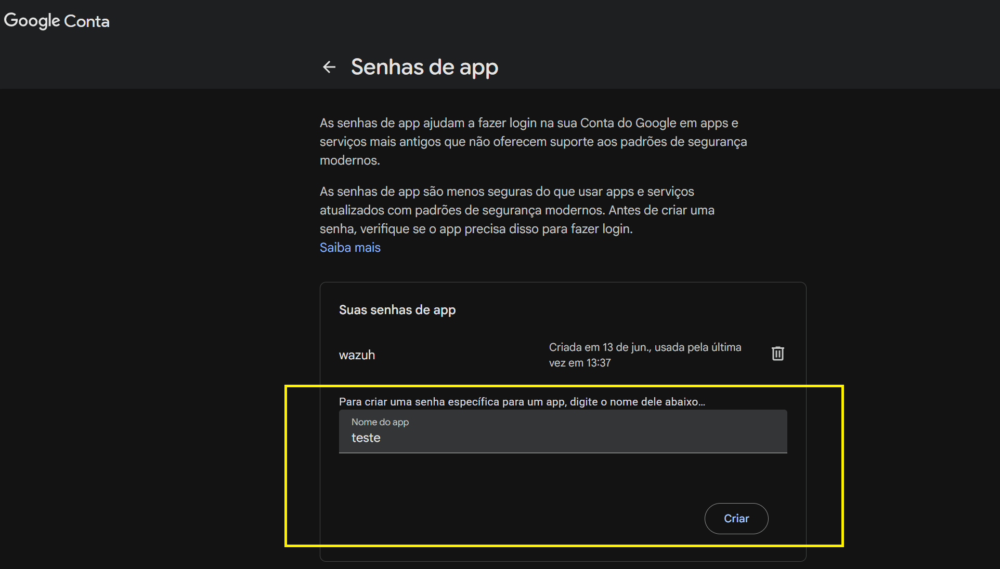
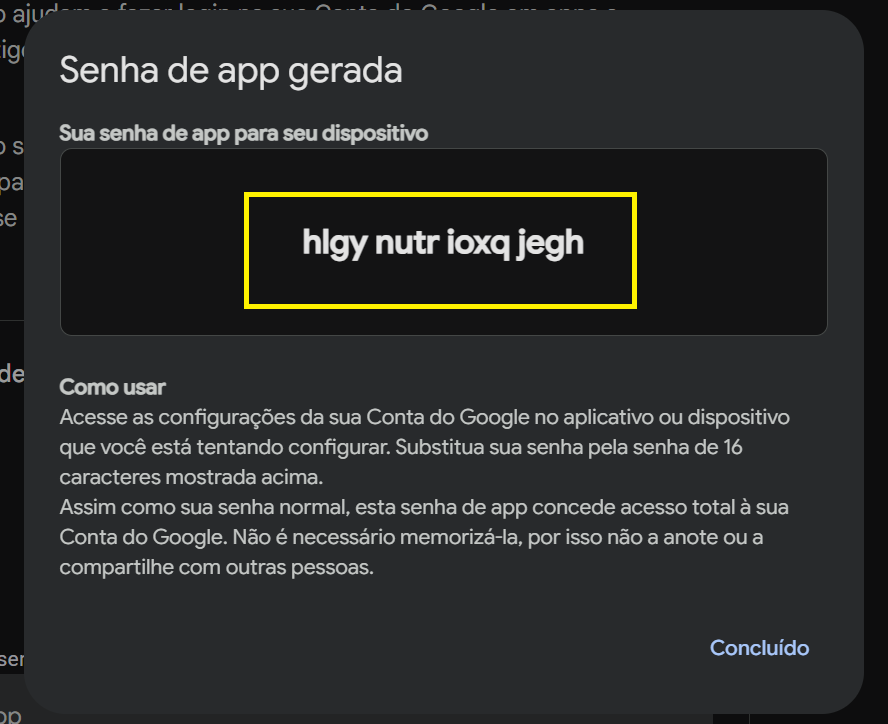
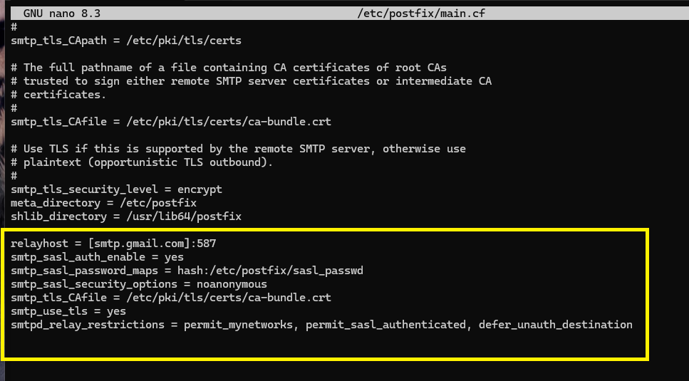
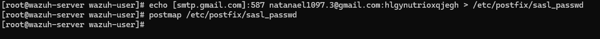
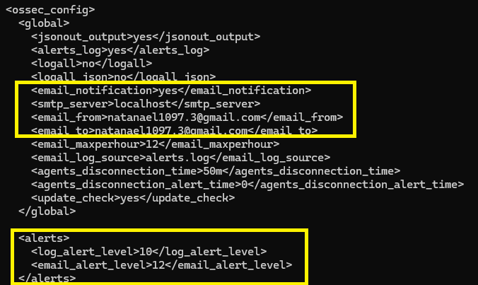
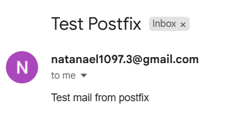

# 📄 Guia de Configuração: Alertas por E-mail no Wazuh com Postfix e Gmail (SMTP)

Documentação completa e passo a passo para configurar o envio de notificações de alertas por e-mail no **Wazuh Manager** utilizando o **Postfix** como agente de transporte de e-mail (MTA) autenticado com o **Gmail SMTP (Porto 587 / TLS)**.

---

## 🔗 Link de Referência Oficial
* **Wazuh Documentation - Alert Management:** [Wazuh SMTP Server with Authentication](https://documentation.wazuh.com/current/user-manual/manager/alert-management.html#smtp-server-with-authentication)

---

## 1. Visão Geral

O envio de notificações por e-mail permite que a equipe de segurança e SOC receba alertas em tempo real diretamente na caixa de entrada quando o **Wazuh Manager** detectar eventos críticos ou de alta gravidade na infraestrutura.

Como o Wazuh Manager faz o envio através do serviço de transporte local de e-mail (MTA), configuramos o **Postfix** no servidor Linux como um *relay host* autenticado com o servidor SMTP do Gmail no porto 587 com criptografia TLS.

---

## 2. Pré-requisitos

* **Wazuh Manager:** Instalado e em execução em um servidor Linux (Ubuntu/Debian/RHEL/CentOS).
* **Acesso Root / Sudo:** Permissões de administrador para instalar pacotes e editar arquivos do sistema.
* **Conta do Gmail:** Com a **Verificação em duas etapas** ativada (requisito obrigatório do Google para criar a Senha de Aplicativo).

---

## 3. Passo 1: Gerar a Senha de Aplicativo (App Password) no Gmail

O Gmail não permite o uso da senha pessoal convencional para autenticação de aplicativos de terceiros. É necessário gerar uma **Senha de Aplicativo** exclusiva de 16 caracteres:

1. Acesse a sua [Conta do Google](https://myaccount.google.com).
2. Vá na aba **Segurança** e confirme que a **Verificação em duas etapas** está ativada.
3. No campo de busca da conta, digite **Senhas de app** (ou acesse diretamente a página de Senhas de App).
4. No campo *Nome do app*, digite um nome identificador (exemplo: `wazuh` ou `teste`).
5. Clique no botão **Criar**.

   
   
7. Uma janela popup exibirá a **Senha de app gerada** contendo 16 caracteres (exemplo: `hlgy nutr ioxq jegh`).

   

📌 **Copie e guarde esta senha de 16 caracteres de forma segura** (remova os espaços ao utilizar nas configurações).


---

## 4. Passo 2: Instalar o Postfix e Dependências no Servidor Wazuh

Acesse o terminal do servidor do Wazuh Manager via SSH e instale o Postfix juntamente com os módulos SASL e utilitários de e-mail:

```bash
sudo apt-get update && sudo apt-get install postfix mailutils libsasl2-2 ca-certificates libsasl2-modules -y
```

> **Durante a instalação do Postfix (Tela de configuração):**
> * **Tipo de configuração de e-mail:** Selecione `Sitio de Internet` (*Internet Site*).
> * **Nome do e-mail do sistema:** Mantenha o FQDN sugerido (ex: `siem.local` ou pressione `Enter`).

---

## 5. Passo 3: Configurar o Postfix (`/etc/postfix/main.cf`)

Edite o arquivo principal de configuração do Postfix:

```bash
sudo nano /etc/postfix/main.cf
```

Role até o final do arquivo e adicione os seguintes parâmetros para habilitar o *relayhost* do Gmail com SASL e TLS:

```ini
relayhost = [smtp.gmail.com]:587
smtp_sasl_auth_enable = yes
smtp_sasl_password_maps = hash:/etc/postfix/sasl_passwd
smtp_sasl_security_options = noanonymous
smtp_tls_CAfile = /etc/ssl/certs/ca-certificates.crt
smtp_use_tls = yes
smtpd_relay_restrictions = permit_mynetworks, permit_sasl_authenticated, defer_unauth_destination
```



Salve e feche o arquivo (`Ctrl + O`, `Enter`, `Ctrl + X`).

---

## 6. Passo 4: Configurar as Credenciais de Autenticação (`sasl_passwd`)

Crie o arquivo `/etc/postfix/sasl_passwd` contendo seu e-mail do Gmail e a Senha de Aplicativo criada no Passo 1 (sem espaços) e entre como sudo/root:

```bash
sudo echo "[smtp.gmail.com]:587 SEU_EMAIL@gmail.com:SUA_SENHA_DE_APP" > /etc/postfix/sasl_passwd
```

### Exemplo Real:
```bash
sudo echo "[smtp.gmail.com]:587 natanael1097.3@gmail.com:hlgynutrioxqjegh" > /etc/postfix/sasl_passwd
```
  

Gere o arquivo de banco de dados do Postfix (`sasl_passwd.db`) e restrinja as permissões para proteger suas credenciais:

```bash
sudo postmap /etc/postfix/sasl_passwd
sudo chmod 600 /etc/postfix/sasl_passwd /etc/postfix/sasl_passwd.db
```

Reinicie o serviço do Postfix para carregar as alterações:

```bash
sudo systemctl restart postfix
```

---

## 7. Passo 5: Testar o Envio de E-mail via Postfix

Antes de integrar ao Wazuh Manager, valide se o Postfix consegue enviar e-mails diretamente do terminal Linux:

```bash
echo "Test mail from postfix" | mail -s "Test Postfix" -r "SEU_EMAIL@gmail.com" SEU_EMAIL@gmail.com
```

### Exemplo Real:
```bash
echo "Test mail from postfix" | mail -s "Test Postfix" -r "natanael1097.3@gmail.com" natanael1097.3@gmail.com
```

Acesse a caixa de entrada (ou caixa de Spam) do seu Gmail e confirme o recebimento da mensagem com o assunto **Test Postfix**.


---

## 8. Passo 6: Configurar o Wazuh Manager (`ossec.conf`)

Com o servidor local Postfix funcionando, configure o Wazuh Manager para direcionar as notificações para o `localhost`.

Abra o arquivo de configuração do Wazuh:

```bash
sudo nano /var/ossec/etc/ossec.conf
```

1. Na seção `<global>`, ative as notificações e defina o servidor SMTP e os e-mails de origem e destino:

   ```xml
   <global>
     <email_notification>yes</email_notification>
     <smtp_server>localhost</smtp_server>
     <email_from>SEU_EMAIL@gmail.com</email_from>
     <email_to>SEU_EMAIL@gmail.com</email_to>
   </global>
   ```

2. Na seção `<alerts>`, defina o nível mínimo de alerta para o disparo de e-mails (por padrão é `12`, mas para testes iniciais você pode ajustar para `3`):

   ```xml
   <alerts>
     <log_alert_level>3</log_alert_level>
     <email_alert_level>3</email_alert_level>
   </alerts>
   ```

> ⚠️ **Nota de Produção:** Em ambientes de produção corporativos, recomenda-se manter o `<email_alert_level>` entre `7` e `12` para evitar o excesso de notificações na caixa de entrada (*alert fatigue*).



Salve e feche o arquivo (`Ctrl + O`, `Enter`, `Ctrl + X`).

---

## 9. Passo 7: Reiniciar o Wazuh Manager e Validar os Alertas

Reinicie o serviço do Wazuh Manager para aplicar a nova configuração:

```bash
sudo systemctl restart wazuh-manager
```

### Validação dos Alertas
Logo após reiniciar o gerenciador, o Wazuh enviará uma notificação automática confirmando a inicialização do servidor:
> **Assunto:** `Wazuh notification - siem - Alert level 3 - "Wazuh server started."`

Sempre que uma regra de segurança com nível igual ou superior ao `email_alert_level` for disparada em qualquer agente ou no próprio servidor, um e-mail estruturado contendo detalhes do evento, ID da regra, usuário e log será entregue na sua caixa de entrada!




